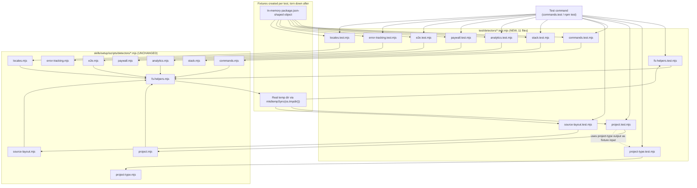

# Technical Plan

## Architecture

This is a test-only addition that extends the existing `test/` suite convention rather than introducing any new architecture layer. The repo already has three top-level `node:test` files (`test/agent-runner.test.ts`, `test/eval-pipeline.test.mjs`, `test/rebuild-context.test.mjs`), each mapping 1:1 to a script under `skills/*/scripts/`. This feature adds a new `test/detectors/` subdirectory containing one `*.test.mjs` file per module under `skills/setup/scripts/detectors/` (10 detector modules plus `fs-helpers.mjs`, 11 files total), mirroring the same `agent-runner.test.ts` ↔ `agent-runner.ts` 1:1 mapping already established. Every detector module is a small, mostly-pure function set that either inspects a `package.json`-shaped object/on-disk file (via `fs-helpers.mjs`'s `exists`/`readJson`/`readText`) or inspects a directory layout on disk; tests exercise these functions directly by importing them and feeding them either in-memory fixture objects or real temp directories created with `mkdtempSync(path.join(os.tmpdir(), ...))`. No detector source file and no `detect-stack.mjs` line changes as part of this feature — the only non-test-file touchpoint is a possible widening of the test command's file-discovery glob/list in `package.json`'s `scripts.test` (the command backing `commands.test` in `.relay/config.json`) so `node --test` actually picks up files nested under `test/detectors/`, plus a dev-log entry documenting that change and any newly discovered (but not fixed) detector bug.

## Diagram

## Impacted Files

- `test/detectors/fs-helpers.test.mjs` — NEW. Tests `exists`, `readJson`, `readText`, `ls`, `findFiles`, `isDirectory` directly against real temp dirs: missing path, malformed JSON, valid JSON, missing text file, present text file. Establishes the real contract (throws vs. returns null/undefined/false) that every other filesystem-based detector test depends on.
- `test/detectors/project-type.test.mjs` — NEW. Tests `detectProjectType` for every classification it can return (at minimum the web / mobile / unknown values referenced by AC 4–6), covering the signals it inspects (e.g. package.json deps, config files) plus a no-signal-found case. Its fixtures are reused as inputs to `project.test.mjs`'s `detectAppId` cases.
- `test/detectors/project.test.mjs` — NEW. Tests `detectProjectName`, `detectAppId` (AC 1–6: Expo static config, Expo dynamic config, Capacitor config, web/unknown/mobile fallback), `detectGithubRepo`, `detectDefaultBranch`. Each function gets at least one happy-path and one no-signal-found case (AC 21).
- `test/detectors/commands.test.mjs` — NEW. Tests `detectPackageManager`, `detectRunScript`, `runScriptPrefix`, `detectTypecheckCmd`, `detectLintCmd`, `detectTestCmd`, `detectFormatCmd`, `detectFormatWriteCmd` (AC 7–20): explicit script wins over tooling, biome vs. eslint/prettier tooling fallback, empty-string fallback when no script and no matching dependency, placeholder test-script exclusion, test:unit/test:ci fallback ordering.
- `test/detectors/source-layout.test.mjs` — NEW. Tests `detectSourceDirs` (AC 11–16: src/ only, app/ only, pages/ only, app/+pages/ hybrid, Expo-router app/_layout.tsx layout, none-present → []), plus `detectSkipDirs` and `detectSourceExtensions` (happy path + no-signal-found).
- `test/detectors/stack.test.mjs` — NEW. Tests `detectRouter`, `detectStyling`, `detectBackend`: one happy-path case per recognized signal and one no-signal-found case per function.
- `test/detectors/analytics.test.mjs` — NEW. Tests `detectAnalytics`: happy-path (recognized analytics dependency present) and no-signal-found case.
- `test/detectors/paywall.test.mjs` — NEW. Tests `detectPaywall`: happy-path (recognized paywall dependency present) and no-signal-found case.
- `test/detectors/e2e.test.mjs` — NEW. Tests `detectE2E`: happy-path (recognized e2e framework dependency/config present) and no-signal-found case.
- `test/detectors/error-tracking.test.mjs` — NEW. Tests `detectErrorTracking`: happy-path (recognized error-tracking dependency present) and no-signal-found case.
- `test/detectors/locales.test.mjs` — NEW. Tests `detectLocales`: happy-path (locale files/config present) and no-signal-found case.
- `package.json` — VERIFY, widen only if needed. Inspect `scripts.test` (the command backing `commands.test` in `.relay/config.json`). If it enumerates explicit files/globs (e.g. `node --test test/*.test.ts test/*.test.mjs`) rather than a recursive pattern that already covers subdirectories, widen it to also include `test/detectors/**/*.test.mjs` (or switch to a recursive `node --test test/` invocation if that safely still runs the three existing top-level files). Do not touch `.relay/config.json` unless the literal command string stored there is itself the thing being changed, and only after confirming the actual runnable command in `package.json` first.
- `.relay/artifacts/features/detector-tests/dev-log.md` — NEW. Document: (a) whether/how the test command's file-discovery pattern was widened and why (per the denied-actions transparency rule on tooling changes), (b) any detector bug uncovered by these tests that is not one of the three already-known regressions described in the brief's Problem & Goals — with symptom, minimal repro, and affected function name — explicitly NOT fixed inline (AC 26).

**Explicitly out of scope / do not modify (verify with a diff before finishing):**
- `skills/setup/scripts/detectors/analytics.mjs`
- `skills/setup/scripts/detectors/commands.mjs`
- `skills/setup/scripts/detectors/e2e.mjs`
- `skills/setup/scripts/detectors/error-tracking.mjs`
- `skills/setup/scripts/detectors/fs-helpers.mjs`
- `skills/setup/scripts/detectors/locales.mjs`
- `skills/setup/scripts/detectors/paywall.mjs`
- `skills/setup/scripts/detectors/project-type.mjs`
- `skills/setup/scripts/detectors/project.mjs`
- `skills/setup/scripts/detectors/source-layout.mjs`
- `skills/setup/scripts/detectors/stack.mjs`
- `skills/setup/scripts/detect-stack.mjs`
- `.relay/config.json` (read-only unless the narrow exception above applies)
- `skills/pipeline/**` (unrelated module)
- `video/**` (unrelated Remotion project)

## Existing Patterns To Reuse

- `test/agent-runner.test.ts` — the direct structural template for every new file: `node:test`-based test blocks, assertions via `node:assert/strict`, and temp-directory lifecycle managed with `node:fs`'s `mkdtempSync`/`rmSync` plus `node:os`'s `tmpdir()` and `node:path`'s `join`. Copy its import style and its temp-dir naming convention (a stable, greppable prefix) into every new file under `test/detectors/`. Confirm on read whether it uses flat `test()` calls or `describe`/`test` nesting, and match that exact shape.
- `test/eval-pipeline.test.mjs` and `test/rebuild-context.test.mjs` — secondary reference for how this repo already tests pure-function modules that take fixture objects directly (no disk I/O) — use this shape for detectors that accept a package.json-shaped object as a parameter rather than reading from disk.
- `skills/setup/scripts/detectors/fs-helpers.mjs`'s own exported functions (`exists`, `readJson`, `readText`) — read these first; they are the shared primitive every filesystem-based detector (`project.mjs`, `commands.mjs`, `source-layout.mjs`, `analytics.mjs`, `e2e.mjs`, `locales.mjs` per the dependency map) sits on top of, so getting `fs-helpers.test.mjs`'s fixtures and expectations right first de-risks every other file.
- The brief's own fixture-pattern rules (Technical Notes → Fixture patterns to standardize across all 10 test files) — treat these as binding conventions: plain-object fixtures for functions that accept a parsed package.json object as an argument; real `mkdtempSync` temp dirs plus `writeFileSync` for functions that read from disk; cleanup via `rmSync(dir, { recursive: true, force: true })` in an `after`/`afterEach` hook (or a `finally` block per test if the module under test doesn't group scenarios).
- Test-naming convention from the brief's E2E/QA §2 — name each test after its acceptance criterion in plain language (e.g. detectAppId returns empty string when project_type is web and no mobile config exists) so a reviewer can map AC to test 1:1 without reading assertions.

## Risks

- **Unresolved exact expected values (brief's Risks & Open Questions #1–2):** the exact fabrication format for `detectAppId` when `project_type === 'mobile'` (AC 6), and the exact expected `detectSourceDirs` output for the Expo-router layout (AC 15) and the app+pages hybrid ordering (AC 14) are not specified anywhere and must not be guessed. Mitigation: read `project.mjs` and `source-layout.mjs` source directly before writing these specific assertions, and assert the actual current return value verbatim — this is a characterization test, not a spec test.
- **Unenumerated exports for 7 modules (brief's Risk #3):** `stack.mjs`, `analytics.mjs`, `paywall.mjs`, `e2e.mjs`, `error-tracking.mjs`, `locales.mjs`, `project-type.mjs` only have their function names known from the architecture map, not their full signal matrix. Mitigation: read each file fully before writing its test file; for every exported function, enumerate every distinct signal it checks (e.g. every dependency name it recognizes) and write one happy-path case per signal plus one no-signal-found case, satisfying AC 21 without inventing behavior.
- **`fs-helpers.mjs` contract on bad input is unknown (brief's Risk #4):** whether `readJson` throws or returns null/undefined on malformed JSON, and whether `readText` throws or returns an empty string on a missing file, is unconfirmed. Mitigation: `fs-helpers.test.mjs` must be written first (see Implementation Order) specifically to pin this down; every downstream detector test's malformed/missing-file expectations must match what this file proves, not what seems intuitive.
- **Multi-tool precedence is untested/undefined territory (brief's Risk #5):** if both biome and eslint (or both biome and prettier) appear as dependencies with no explicit script, current precedence may be arbitrary or genuinely undefined. Mitigation: if `commands.mjs` source shows a clear, deterministic precedence (e.g. an if/else if chain), write a test locking that order in; if the order is ambiguous or dependent on object key iteration, do not write a brittle test asserting a specific winner — instead log this as a discovered gap in the dev log per AC 26 rather than fabricating an expectation.
- **Temptation to fix while testing:** because the brief documents three known bugs by name, there is a real risk of reflexively patching a fourth bug the moment a test fails against current behavior. This is explicitly forbidden by AC 25/26 and the denied-actions rule against implementing fixes not in the brief. Any failing assertion against current source must be resolved by changing the test's expectation to match real behavior (if the test's assumption was wrong) or by documenting a genuine new bug in the dev log (if the assumption was right and the source is wrong) — never by editing a detector file.
- **Temp-directory collisions / leaked residue:** `node:test` may run files concurrently; reused or non-unique `mkdtempSync` prefixes across files, or a missing `after`/`afterEach` cleanup on a thrown assertion, can leave residue under `os.tmpdir()` or cause cross-test interference. Mitigation: give every test file its own unique temp-dir prefix (e.g. relay-detector-project-, relay-detector-sourcelayout-) and always clean up in a finally/after hook, never only at the end of a happy path.
- **`detectGithubRepo` / `detectDefaultBranch` I/O source is unconfirmed:** the dependency map shows `project.mjs` importing only `path` and `./fs-helpers.mjs` (no `child_process`), suggesting these read `.git/config` or `package.json` as text/JSON rather than shelling out to git — but this must be confirmed by reading `project.mjs` before writing fixtures, since a wrong assumption here would require child_process mocking (out of scope — no new mocking library may be introduced per Scope §1) rather than a plain temp-dir fixture.
- **Test-runner glob change could under- or over-match:** widening `scripts.test` incorrectly (e.g. a glob that also picks up non-test helper files, or one that still misses nested files due to shell globbing/quoting differences) could silently skip the new tests or break the three existing top-level test files. Mitigation: after changing the script, run it locally and explicitly confirm (by output line count / file list) that all 3 existing plus 11 new files were executed, not just that the process exited 0.

## Implementation Order

1. Read `test/agent-runner.test.ts` in full to confirm the exact `node:test` style, assertion helpers used, and temp-dir lifecycle pattern to mirror.
2. Read `skills/setup/scripts/detectors/fs-helpers.mjs` in full and write `test/detectors/fs-helpers.test.mjs` first — this pins down the real contract (`exists`/`readJson`/`readText` behavior on missing/malformed input) that every other filesystem-based detector test will assert against.
3. Read `skills/setup/scripts/detectors/project-type.mjs` and write `test/detectors/project-type.test.mjs` — its output is a required input fixture for `detectAppId`'s AC 4–6, so it must be understood and tested before `project.test.mjs`.
4. Read `skills/setup/scripts/detectors/project.mjs` and write `test/detectors/project.test.mjs`, resolving the exact mobile fabrication format and the `detectGithubRepo`/`detectDefaultBranch` I/O-source question by direct source inspection.
5. Read `skills/setup/scripts/detectors/commands.mjs` and write `test/detectors/commands.test.mjs`, resolving the multi-tool precedence question by direct source inspection.
6. Read `skills/setup/scripts/detectors/source-layout.mjs` and write `test/detectors/source-layout.test.mjs`, resolving the Expo-router and hybrid-ordering exact values by direct source inspection.
7. Read and write test files for the remaining six modules in any order: `stack.mjs` → `stack.test.mjs`, `analytics.mjs` → `analytics.test.mjs`, `paywall.mjs` → `paywall.test.mjs`, `e2e.mjs` → `e2e.test.mjs`, `error-tracking.mjs` → `error-tracking.test.mjs`, `locales.mjs` → `locales.test.mjs` — each with happy-path plus no-signal-found coverage per exported function.
8. Inspect the current `package.json` `scripts.test` value; widen its file-discovery pattern only if it does not already pick up nested files under `test/detectors/`, and note the before/after command in the dev log if changed.
9. Run the full configured test command locally; confirm all 11 new files plus the 3 existing files pass, with zero skips and zero weakened assertions.
10. Run `git status`/`git diff` and confirm zero changes under `skills/setup/scripts/detectors/` and to `skills/setup/scripts/detect-stack.mjs` (AC 25).
11. Write `.relay/artifacts/features/detector-tests/dev-log.md` documenting the test-glob decision and any newly discovered (undocumented) detector bug, per AC 26 — without fixing it.
12. Do a final AC-to-test traceability pass: for each of AC 1–20, confirm there is one specifically-named test case in the corresponding file that maps to it 1:1 (per E2E/QA §2).

## Testing Strategy

- **AC 1–6 (`detectAppId`):** in `project.test.mjs`, create a temp dir per scenario via `mkdtempSync` with only the relevant marker file (app.json with expo + ios.bundleIdentifier/android.package; app.config.js/app.config.ts resolving to an expo object; capacitor.config.json/capacitor.config.ts with appId), call `detectAppId` against that dir, and assert the returned id. For AC 4/5/6, use a temp dir with no mobile config and pass project_type of web, unknown, and mobile respectively, asserting an empty string for the first two and the actual current fabricated string for the third (read from source, not guessed).
- **AC 7–10 (`detectLintCmd`/`detectFormatCmd`/`detectFormatWriteCmd`):** in `commands.test.mjs`, pass in-memory package.json-shaped objects: one with an explicit script (assert verbatim passthrough even with a competing dependency present), one with only a biome/@biomejs/biome dependency, one with only eslint/prettier, and one with empty/missing scripts and dependencies/devDependencies (assert an empty string, not a fabricated default).
- **AC 11–16 (`detectSourceDirs`):** in `source-layout.test.mjs`, create a fresh temp dir per scenario with only src/, only app/, only pages/, both app/+pages/, app/_layout.tsx (Expo-router), and none of the three — assert ['src'], ['app'], ['pages'], the actual hybrid order, the actual Expo-router result, and [] respectively.
- **AC 17–20 (`detectTestCmd`):** in `commands.test.mjs`, pass objects with a real test script, a placeholder test script (the npm init default containing the phrase 'no test specified'), a test:unit plus test:ci combination (assert test:unit preferred), and no test-related script at all (assert an empty string).
- **AC 21 (baseline coverage for every other export):** for `project.mjs` (`detectProjectName`, `detectGithubRepo`, `detectDefaultBranch`), `project-type.mjs` (`detectProjectType`), `stack.mjs` (`detectRouter`, `detectStyling`, `detectBackend`), `analytics.mjs`, `paywall.mjs`, `e2e.mjs`, `error-tracking.mjs`, `locales.mjs` (`detectLocales`), and `source-layout.mjs`'s `detectSkipDirs`/`detectSourceExtensions`: verify each has at minimum one happy-path test and one no-signal-found test in its corresponding file, using the same package.json-object / temp-dir fixture patterns.
- **AC 22 (runs via configured test command):** after implementation, run the exact command in `.relay/config.json`'s `commands.test` (or `npm test` if that's what it wraps) locally and confirm exit code 0 with all 11 new plus 3 existing files reported as run.
- **AC 23 (no new test framework/library):** manually confirm every new file's only imports are from `node:test`, `node:assert`/`node:assert/strict`, `node:fs`, `node:os`, and `node:path`, plus the detector module(s) under test — grep for any other import/require before finishing.
- **AC 24 (real temp dirs, cleaned up):** for every filesystem-based test file, confirm a cleanup call (`rmSync(dir, { recursive: true, force: true })`) exists in an `after`/`afterEach` hook (or finally block) for every `mkdtempSync` call; run the suite twice in a row locally and confirm no leftover relay-detector-* directories accumulate under `os.tmpdir()`.
- **AC 25 (no production file changes):** run `git status --porcelain -- skills/setup/scripts/detectors skills/setup/scripts/detect-stack.mjs` (or equivalent) after implementation and confirm empty output.
- **AC 26 (dev log for new bugs):** if any written assertion, once checked against actual source behavior, reveals a behavior that contradicts the spirit of the brief's three known-bug fixes (i.e. a fourth silent-fabrication-style bug), do not adjust the detector — write it up in `.relay/artifacts/features/detector-tests/dev-log.md` with symptom, minimal repro (fixture plus expected vs. actual), and the affected exported function name.

## Task Breakdown

- [ ] Read `test/agent-runner.test.ts` to confirm exact test-file conventions to mirror
- [ ] Read `skills/setup/scripts/detectors/fs-helpers.mjs`; write `test/detectors/fs-helpers.test.mjs` (missing file, malformed JSON, valid JSON/text cases for exists/readJson/readText/ls/findFiles/isDirectory)
- [ ] Read `skills/setup/scripts/detectors/project-type.mjs`; write `test/detectors/project-type.test.mjs`
- [ ] Read `skills/setup/scripts/detectors/project.mjs`; write `test/detectors/project.test.mjs` covering AC 1–6 plus detectProjectName/detectGithubRepo/detectDefaultBranch
- [ ] Read `skills/setup/scripts/detectors/commands.mjs`; write `test/detectors/commands.test.mjs` covering AC 7–20 plus detectPackageManager/detectRunScript/runScriptPrefix/detectTypecheckCmd
- [ ] Read `skills/setup/scripts/detectors/source-layout.mjs`; write `test/detectors/source-layout.test.mjs` covering AC 11–16 plus detectSkipDirs/detectSourceExtensions
- [ ] Read `skills/setup/scripts/detectors/stack.mjs`; write `test/detectors/stack.test.mjs`
- [ ] Read `skills/setup/scripts/detectors/analytics.mjs`; write `test/detectors/analytics.test.mjs`
- [ ] Read `skills/setup/scripts/detectors/paywall.mjs`; write `test/detectors/paywall.test.mjs`
- [ ] Read `skills/setup/scripts/detectors/e2e.mjs`; write `test/detectors/e2e.test.mjs`
- [ ] Read `skills/setup/scripts/detectors/error-tracking.mjs`; write `test/detectors/error-tracking.test.mjs`
- [ ] Read `skills/setup/scripts/detectors/locales.mjs`; write `test/detectors/locales.test.mjs`
- [ ] Inspect `package.json`'s scripts.test; widen the file-discovery glob/list only if `test/detectors/**/*.test.mjs` isn't already covered
- [ ] Run the full configured test command locally; confirm all new plus existing tests pass with zero skips
- [ ] Run `git status`/`git diff` to confirm zero changes under `skills/setup/scripts/detectors/` and `detect-stack.mjs`
- [ ] Write `.relay/artifacts/features/detector-tests/dev-log.md` documenting the test-glob decision and any newly discovered bug (not fixed)
- [ ] Final pass: verify every AC 1–26 maps to a specifically-named test case or explicit process step
